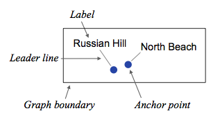

D3-Labeler
=========

A D3 plug-in for automatic label placement using simulated annealing that easily incorporates into existing D3 code, with syntax mirroring other D3 layouts. 

Installation
------------

Download <i>labeler.js</i>. Include the plug-in in the relevant .html file with:
```html
<script src="labeler.js"></script>
```

Components of a labeling problem
--------------------------------



Each *label* corresponds to an *anchor point*. A *leader line* may be used to help with the correspondence between the *label* and *anchor point*. None of the elements may cross the *graph boundary*.

Usage
-----------------

To automatically place labels, users declare a labeler (simulated annealing) layout, input label and anchor positions, the figure boundaries, and the number of Monte Carlo sweeps for simulated annealing. The general pattern is as follows:
```javascript
var labels = d3.labeler()
               .nodes(label_array)
               .anchor(anchor_array)
               .width(w)
               .height(h)
               .start(nsweeps);
```
The default settings are: <i>w</i> = 1, <i>h</i> = 1, and <i>nsweeps</i> = 1000. The default <i>label_array</i> and <i>anchor_array</i> are empty arrays. Here we describe each term in more detail.

d3.<b>labeler</b>()

Start by declaring a labeling layout, the same as declaring any other D3 layout.

labeler.<b>label</b>([<i>label_array</i>])

Each label has the following attributes. Note that width and height can be easily measured using the SVG getBBox() method. The dimensions are used to calculate overlaps.

* x - the *x*-coordinate of the label.
* y - the *y*-coordinate of the label.
* width - the *width* of the label (approximating the label as a rectangle).
* height - the *height* of the label (same approximation).
* name - the label text.

labeler.<b>anchor</b>([<i>anchor_array</i>])

Each anchor has the following attributes:

* x - the *x*-coordinate of the anchor.
* y - the *y*-coordinate of the anchor.
* r - the anchor radius (assuming anchor is a circle). 

labeler.<b>width</b>(<i>w</i>)

labeler.<b>height</b>(<i>h</i>)

The width and height are used to set the boundary conditions so that labels do not go outside the width and height of the figure. More specifically, Monte Carlo moves in which the labels cross the boundaries are rejected. If they are not specified, both the width and height default to 1. 

labeler.<b>start</b>(<i>nsweeps</i>)

Finally, we specify the number of Monte Carlo sweeps for the optimization and run the simulated annealing procedure. The default for <i>nsweeps</i> is 1000. Note that one Monte Carlo sweep means that on average, each label is translated or rotated once. To obtain the actual number of Monte Carlo steps taken, multiply the number of sweeps by the number of labels.

labeler.<b>alt_energy</b>(<i>user_defined_energy</i>)

This function is constructed for <i>expert users</i>. The quality of the configuration is closely related to the energy function. The default energy function includes general labeling preferences (details below) and is suggested for most users. However, a user may wish to define his or her own energy function to suit individual preferences. 
```javascript
new_energy_function = function(index, label_array, anchor_array) {
    var ener = 0;
    // insert user-defined interaction energies here
    return ener;
}
```
The newly constructed function must take as input an integer <i>index</i>, an array of labels <i>label_array</i>, and an array of anchors <i>anchor_array</i>. This function must also return an energy term that should correspond to the energy of a particular label, namely <i>label_array[index]</i>. One may wish calculate an energy of interaction for <i>label_array[index]</i> with all other labels and anchors. 
```javascript
var labels = d3.labeler()
               .nodes(label_array)
               .anchor(anchor_array)
               .width(w)
               .height(h)
               .start(nsweeps);
```

labeler.<b>alt_schedule</b>(<i>user_defined_schedule</i>)

Similarly, an expert user may wish to include a custom cooling schedule used in the simulated annealing procedure. The default cooling schedule is linear. 
```javascript
new_cooling_schedule = function(currT, initialT, nsweeps) {
    // insert user-defined schedule here
    return updatedT;
}
```
This function takes as input the current simulation temperature <i>currT</i>, the initial temperature <i>initialT</i>, and the total number of sweeps <i>nsweeps</i> and returns the updated temperature <i>updatedT</i>. The user defined functions can be included as follows:

```javascript
var labels = d3.labeler()
               .nodes(label_array)
               .anchor(anchor_array)
               .width(w)
               .height(h)
               .alt_energy(new_energy_function)
               .alt_schedule(new_cooling_schedule)
               .start(nsweeps);
```


Default energy function details
-------------------------------

In order to distinguish between the quality of different configurations in our search space, we need construct a function which takes as input a label configuration and outputs a score indicating the quality of the placements. In a labeling problem, the inputs are themselves functions of various parameters such as the amount of overlaps, distances between labels and their corresponding anchor points, and various stylistic preferences. This function, often an energy (also called cost or objective) function, is what we need to optimize. The default energy function includes penalties for:

* Label-label overlaps
* Label-anchor overlaps
* Labels far from the corresponding anchor
* Leader line intersections
* Poorly oriented labels

Author
------
* Evan Wang (<evan.wang@berkeley.edu>)
